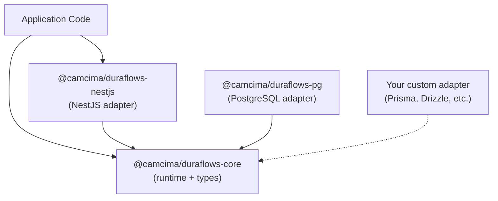

<div align="center">

<picture>
  
</picture>

<br>

[](https://github.com/camcima/duraflows/actions/workflows/test.yml)
[](https://github.com/camcima/duraflows/actions/workflows/validate.yml)
[](https://codecov.io/gh/camcima/duraflows)
[](https://www.npmjs.com/package/@camcima/duraflows-core)
[](https://opensource.org/licenses/MIT)
[](https://www.typescriptlang.org/)
[](https://nodejs.org/)

</div>

A durable workflow runtime for TypeScript built on top of [@camcima/finita](https://github.com/camcima/finita). Supports named states, event-triggered transitions, sequential command execution with success/failure branching, timeout-driven transitions, mutable workflow context, and full audit history.

Designed as a family of three packages:

| Package | Purpose |
|---------|---------|
| `@camcima/duraflows-core` | Framework-agnostic runtime, types, and persistence interfaces |
| `@camcima/duraflows-pg` | PostgreSQL persistence adapter using `pg` |
| `@camcima/duraflows-nestjs` | NestJS module integration with DI, services, and optional REST controllers |

## Key Features

- **Declarative workflow definitions** in plain TypeScript objects
- **Command execution** with sequential fail-fast policy and success/failure branching
- **Timeout processing** with persisted deadlines and batch processing
- **Mutable context** accessible to commands, with state-defined patches merged on entry
- **Immutable metadata** for identity labels that never change after creation
- **Full audit history** of every transition with command results
- **Row-level locking** for concurrent access safety
- **Persistence-agnostic core** -- bring your own database library (pg, Prisma, Drizzle, TypeORM)
- **NestJS integration** with dependency injection, services, and optional REST controllers

## Installation

```bash
# Core runtime (always required)
npm install @camcima/duraflows-core

# PostgreSQL adapter (if using pg)
npm install @camcima/duraflows-pg pg

# NestJS integration (if using NestJS)
npm install @camcima/duraflows-nestjs
```

## Quick Example

### Define a Workflow

```ts
import type { WorkflowDefinition } from "@camcima/duraflows-core";

const orderWorkflow: WorkflowDefinition = {
  name: "order",
  initialState: "new",
  states: {
    new: {
      context: { paymentStatus: "pending", isActive: true },
      events: {
        PaymentReceived: {
          targetState: "exportable",
        },
        Cancel: {
          targetState: "cancelled",
        },
      },
    },
    exportable: {
      context: { paymentStatus: "paid" },
      events: {
        Export: {
          targetState: "exported",
          errorState: "export_failed",
          commands: [
            { name: "sendOrderToWarehouse" },
            { name: "notifyCustomer" },
          ],
        },
      },
    },
    exported: {
      context: { shipmentStatus: "shipped" },
      events: {
        Deliver: { targetState: "delivered" },
      },
    },
    delivered: {
      context: { shipmentStatus: "delivered", isActive: false },
      events: {
        TimeOut: {
          targetState: "closed",
          timeout: { afterDays: 14 },
        },
      },
    },
    closed: {},
    cancelled: {
      context: { isActive: false },
    },
    export_failed: {
      events: {
        RetryExport: {
          targetState: "exportable",
        },
      },
    },
  },
};
```

### Implement Command Handlers

```ts
import type { WorkflowCommand, CommandResult, WorkflowExecutionContext } from "@camcima/duraflows-core";

class SendOrderToWarehouseCommand implements WorkflowCommand {
  async execute(subject: unknown, ctx: WorkflowExecutionContext): Promise<CommandResult> {
    // Read immutable metadata
    const orderId = ctx.metadata.orderId as string;

    try {
      const shipment = await warehouseApi.createShipment(subject);

      // Write to mutable context — persisted after transition
      ctx.context.shipmentId = shipment.id;
      ctx.context.shippedAt = ctx.now.toISOString();

      return { ok: true, code: "SHIPPED" };
    } catch (err) {
      return { ok: false, code: "WH_ERROR", message: String(err) };
    }
  }
}
```

### Use with NestJS

```ts
import { Module } from "@nestjs/common";
import { Pool } from "pg";
import { WorkflowModule } from "@camcima/duraflows-nestjs";
import { pgWorkflowProviders } from "@camcima/duraflows-pg";

const pool = new Pool({ connectionString: process.env.DATABASE_URL });

@Module({
  imports: [
    WorkflowModule.forRoot({
      workflows: [orderWorkflow],
      commands: [
        { name: "sendOrderToWarehouse", useClass: SendOrderToWarehouseCommand },
        { name: "notifyCustomer", useClass: NotifyCustomerCommand },
      ],
      persistence: pgWorkflowProviders(pool),
      enableControllers: true, // optional REST endpoints
    }),
  ],
})
export class AppModule {}
```

```ts
import { Injectable } from "@nestjs/common";
import { WorkflowService } from "@camcima/duraflows-nestjs";

@Injectable()
export class OrderService {
  constructor(private readonly workflowService: WorkflowService) {}

  async createOrder(orderData: CreateOrderDto) {
    const order = await this.orderRepo.create(orderData);

    const instance = await this.workflowService.createInstance({
      workflowName: "order",
      metadata: { orderId: order.uuid },
      trigger: { type: "system" },
    });

    return { order, workflowInstanceUuid: instance.uuid };
  }

  async receivePayment(workflowInstanceUuid: string, order: Order) {
    const result = await this.workflowService.triggerEvent({
      workflowInstanceUuid,
      eventName: "PaymentReceived",
      subject: order,
      trigger: { type: "user", actorUuid: order.customerUuid },
    });

    console.log(result.outcome); // "success"
    console.log(result.toState); // "exportable"
  }
}
```

### Use Without NestJS

```ts
import {
  WorkflowRuntime,
  InMemoryDefinitionRegistry,
  InMemoryCommandRegistry,
} from "@camcima/duraflows-core";
import { pgWorkflowProviders } from "@camcima/duraflows-pg";
import { Pool } from "pg";

const pool = new Pool({ connectionString: process.env.DATABASE_URL });
const persistence = pgWorkflowProviders(pool);

const definitionRegistry = new InMemoryDefinitionRegistry();
definitionRegistry.register(orderWorkflow);

const commandRegistry = new InMemoryCommandRegistry();
commandRegistry.register("sendOrderToWarehouse", new SendOrderToWarehouseCommand());
commandRegistry.register("notifyCustomer", new NotifyCustomerCommand());

const runtime = new WorkflowRuntime({
  definitionRegistry,
  commandRegistry,
  ...persistence,
  clock: { now: () => new Date() },
});

// Create an instance
const instance = await runtime.createInstance({
  workflowName: "order",
  trigger: { type: "system" },
});

// Trigger an event
const result = await runtime.triggerEvent({
  workflowInstanceUuid: instance.uuid,
  eventName: "PaymentReceived",
  subject: orderEntity,
  trigger: { type: "system" },
});
```

## Database Setup

The `@camcima/duraflows-pg` package provides two ways to set up the database schema:

### Option 1: Copy the reference migration

A ready-made dbmate migration is shipped at:

```
node_modules/@camcima/duraflows-pg/sql/dbmate/001_workflow_core.sql
```

Copy it into your migration directory. It uses `gen_random_uuid()` (PostgreSQL 13+) for history record UUIDs.

### Option 2: Generate a migration with `generateMigrationSql()`

Use this to choose between `gen_random_uuid()` (PG 13+) and `uuidv7()` (PG 18+, time-ordered):

```ts
import { generateMigrationSql } from "@camcima/duraflows-pg";

// For PostgreSQL 18+ (time-ordered UUIDs)
const { up, down } = generateMigrationSql({ uuidStrategy: "uuidv7" });

// For PostgreSQL 13-17 (random UUIDs, the default)
const { up, down } = generateMigrationSql();
```

Paste the `up` and `down` SQL into your migration file.

Both options create two tables: `workflow_instances` and `workflow_history`.

## Custom Persistence Adapters

The NestJS module and the core runtime are fully decoupled from `pg`. To use Prisma, Drizzle, TypeORM, or any other library, implement three interfaces from `@camcima/duraflows-core`:

- `WorkflowInstanceStore`
- `WorkflowHistoryStore`
- `WorkflowTransactionRunner`

See the [Persistence Guide](docs/persistence.md) for details and examples.

## Documentation

| Document | Description |
|----------|-------------|
| [Getting Started](docs/getting-started.md) | Installation, database setup, first workflow |
| [Workflow Definitions](docs/workflow-definitions.md) | States, events, commands, timeouts, context and metadata |
| [Core Runtime API](docs/core-runtime.md) | WorkflowRuntime, compiler, validator, executors |
| [Persistence](docs/persistence.md) | Interfaces, pg adapter, custom adapters |
| [NestJS Integration](docs/nestjs-integration.md) | Module, services, controllers, DI tokens |
| [Error Handling](docs/error-handling.md) | Error types, when they occur, how to handle them |

## Architecture



`duraflows-nestjs` depends only on `duraflows-core` interfaces. `duraflows-pg` is one persistence adapter. You can replace it with your own.

## License

MIT
