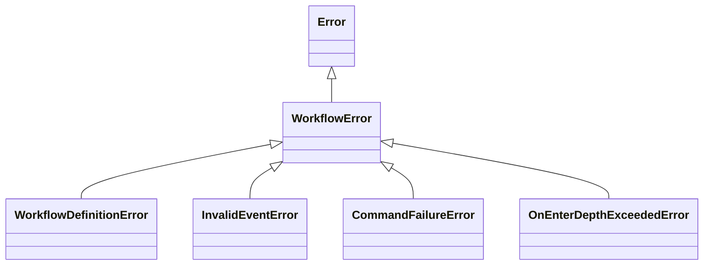

# Error Handling

The workflow runtime defines a hierarchy of error classes that represent different failure modes. All errors extend `WorkflowError`, which extends the native `Error`.

## Error Hierarchy



## WorkflowError

Base class for all workflow errors.

```ts
class WorkflowError extends Error {
  constructor(message: string, cause?: unknown);
}
```

| Property  | Type      | Description                                        |
| --------- | --------- | -------------------------------------------------- |
| `message` | `string`  | Error description                                  |
| `cause`   | `unknown` | Optional underlying cause (standard `Error.cause`) |

**When thrown:**

- Workflow instance not found (by UUID)
- Optimistic locking failure — the instance was modified concurrently (e.g., `'Optimistic locking failure: workflow instance "..." was modified concurrently (expected version 3)'`)
- Command not found in registry

```ts
try {
  await runtime.triggerEvent({ workflowInstanceUuid: "nonexistent", ... });
} catch (err) {
  if (err instanceof WorkflowError) {
    console.error(err.message);
    // 'Workflow instance "nonexistent" not found'
  }
}
```

## WorkflowDefinitionError

Thrown when a workflow definition is invalid or not found.

```ts
class WorkflowDefinitionError extends WorkflowError {
  readonly workflowName: string;
  constructor(workflowName: string, message: string);
}
```

| Property       | Type     | Description                             |
| -------------- | -------- | --------------------------------------- |
| `workflowName` | `string` | The workflow name that caused the error |

**When thrown:**

- Registering a duplicate workflow name via `InMemoryDefinitionRegistry.register()`
- Validation failure during `register()` (e.g., invalid state references, missing target states, unknown command names)
- Compilation failure during `register()` (e.g., non-existent target/error state in finita process)
- Looking up a workflow that doesn't exist in the registry (via `get()`)
- Startup validation in NestJS: a command name referenced in a workflow definition has no registered implementation (neither via `@WorkflowCommand` decorator nor explicit `commands` array)

```ts
try {
  await runtime.createInstance({ workflowName: "nonexistent", ... });
} catch (err) {
  if (err instanceof WorkflowDefinitionError) {
    console.error(err.workflowName); // "nonexistent"
    console.error(err.message);      // 'Workflow "nonexistent": Workflow not found in registry'
  }
}
```

**Validation errors include details:**

```ts
try {
  // Validation happens at registration time, not at runtime
  definitionRegistry.register({
    name: "bad",
    initialState: "missing",
    states: { start: {} },
  });
} catch (err) {
  if (err instanceof WorkflowDefinitionError) {
    console.error(err.message);
    // 'Workflow "bad": Invalid definition: Initial state "missing" does not exist in states'
  }
}
```

## InvalidEventError

Thrown when an event does not exist on the current state.

```ts
class InvalidEventError extends WorkflowError {
  readonly workflowInstanceUuid: string;
  readonly currentState: string;
  readonly eventName: string;
  constructor(workflowInstanceUuid: string, currentState: string, eventName: string);
}
```

| Property               | Type     | Description                       |
| ---------------------- | -------- | --------------------------------- |
| `workflowInstanceUuid` | `string` | The instance UUID                 |
| `currentState`         | `string` | The current state of the instance |
| `eventName`            | `string` | The event that was attempted      |

**When thrown:** `triggerEvent()` is called with an event name that is not defined on the instance's current state.

```ts
try {
  await runtime.triggerEvent({
    workflowInstanceUuid: instance.uuid,
    eventName: "Ship", // not available in "new" state
  });
} catch (err) {
  if (err instanceof InvalidEventError) {
    console.error(err.currentState); // "new"
    console.error(err.eventName); // "Ship"
  }
}
```

## CommandFailureError

Thrown when a command returns `{ ok: false }` and the event has no `errorState` to transition to.

```ts
class CommandFailureError extends WorkflowError {
  readonly workflowInstanceUuid: string;
  readonly eventName: string;
  readonly commandName: string;
  readonly result: CommandResult;
  constructor(workflowInstanceUuid: string, eventName: string, commandName: string, result: CommandResult);
}
```

| Property               | Type            | Description                         |
| ---------------------- | --------------- | ----------------------------------- |
| `workflowInstanceUuid` | `string`        | The instance UUID                   |
| `eventName`            | `string`        | The event being processed           |
| `commandName`          | `string`        | The command that failed             |
| `result`               | `CommandResult` | The failure result from the command |

**When thrown:** A command returns `{ ok: false }` and the event does not define an `errorState`. Since there's no error state to transition to, the failure is surfaced as an exception.

```ts
// Event definition:
// PaymentReceived: { targetState: "paid" }  // no errorState!

// Command returns { ok: false }

try {
  await runtime.triggerEvent({
    workflowInstanceUuid: instance.uuid,
    eventName: "PaymentReceived",
    subject: order,
  });
} catch (err) {
  if (err instanceof CommandFailureError) {
    console.error(err.commandName); // "chargePayment"
    console.error(err.result.code); // "INSUFFICIENT_FUNDS"
    console.error(err.result.message); // "Card declined"
  }
}
```

**How to fix:** Add an `errorState` to the event definition so command failures transition gracefully instead of throwing:

```ts
PaymentReceived: {
  targetState: "paid",
  errorState: "payment_failed", // now failures transition here instead of throwing
  commands: [{ name: "chargePayment" }],
}
```

## OnEnterDepthExceededError

Thrown when an onEnter auto-transition chain exceeds the maximum allowed depth.

```ts
class OnEnterDepthExceededError extends WorkflowError {
  readonly workflowInstanceUuid: string;
  readonly stateName: string;
  readonly depth: number;
  constructor(workflowInstanceUuid: string, stateName: string, depth: number);
}
```

| Property               | Type     | Description                                 |
| ---------------------- | -------- | ------------------------------------------- |
| `workflowInstanceUuid` | `string` | The instance UUID                           |
| `stateName`            | `string` | The state where the depth limit was reached |
| `depth`                | `number` | The maximum depth that was exceeded         |

**When thrown:** An onEnter chain exceeds the configured `maxOnEnterDepth` (default 10). This is a safety guard against infinite loops caused by misconfigured onEnter chains.

```ts
try {
  await runtime.triggerEvent({
    workflowInstanceUuid: instance.uuid,
    eventName: "Start",
  });
} catch (err) {
  if (err instanceof OnEnterDepthExceededError) {
    console.error(err.stateName); // state where depth was exceeded
    console.error(err.depth); // 10
  }
}
```

**How to fix:** Review the onEnter chain for unintended loops. The static cycle detector at registration time catches direct cycles, but complex chains with many hops (without cycles) can still exceed the depth limit. Increase `maxOnEnterDepth` in `WorkflowRuntimeOptions` if the chain depth is intentional.

## Command Exceptions vs. Command Failures

There are two distinct failure modes for commands:

### Controlled Failure (returns `{ ok: false }`)

The command returns a structured failure. This is a **business failure** -- the command executed but the operation could not be completed (e.g., payment declined, inventory unavailable).

- If `errorState` is defined: workflow transitions to `errorState`, `outcome` is `"failure"`, history is recorded
- If `errorState` is not defined: throws `CommandFailureError`, no transition, transaction rolls back

### Uncontrolled Failure (throws an exception)

The command throws an error. This is a **technical failure** -- the command could not execute at all (e.g., network error, database crash).

- The exception propagates through `triggerEvent()`
- No state transition occurs
- No history record is created
- The transaction rolls back completely
- The workflow instance remains in its previous state

### Decision Guide

| Scenario                 | Command should...               | Event definition                    |
| ------------------------ | ------------------------------- | ----------------------------------- |
| Payment declined         | Return `{ ok: false }`          | Include `errorState`                |
| API timeout              | Throw or return `{ ok: false }` | Include `errorState` if recoverable |
| Database connection lost | Let the exception propagate     | N/A (infrastructure failure)        |
| Validation failure       | Return `{ ok: false }`          | Include `errorState`                |
| Bug in command code      | Let the exception propagate     | N/A (fix the bug)                   |

## Error Handling Patterns

### Catch Specific Errors

```ts
import {
  WorkflowError,
  WorkflowDefinitionError,
  InvalidEventError,
  CommandFailureError,
  OnEnterDepthExceededError,
} from "@duraflows/core";

try {
  const result = await runtime.triggerEvent(input);
} catch (err) {
  if (err instanceof InvalidEventError) {
    // Event not available on current state
    return { status: 400, message: `Event "${err.eventName}" is not available in state "${err.currentState}"` };
  }
  if (err instanceof CommandFailureError) {
    // Command failed with no error state
    return { status: 422, message: `Command "${err.commandName}" failed: ${err.result.message}` };
  }
  if (err instanceof OnEnterDepthExceededError) {
    // onEnter chain too deep -- likely a configuration issue
    return { status: 500, message: err.message };
  }
  if (err instanceof WorkflowError) {
    // Other workflow error (instance not found, etc.)
    return { status: 404, message: err.message };
  }
  // Infrastructure error
  throw err;
}
```

### NestJS Exception Filter

```ts
import { ExceptionFilter, Catch, ArgumentsHost, HttpStatus } from "@nestjs/common";
import { InvalidEventError, CommandFailureError, WorkflowError } from "@duraflows/core";

@Catch(WorkflowError)
export class WorkflowExceptionFilter implements ExceptionFilter {
  catch(exception: WorkflowError, host: ArgumentsHost) {
    const ctx = host.switchToHttp();
    const response = ctx.getResponse();

    let status = HttpStatus.INTERNAL_SERVER_ERROR;
    if (exception instanceof InvalidEventError) status = HttpStatus.BAD_REQUEST;
    if (exception instanceof CommandFailureError) status = HttpStatus.UNPROCESSABLE_ENTITY;

    response.status(status).json({
      error: exception.name,
      message: exception.message,
    });
  }
}
```
