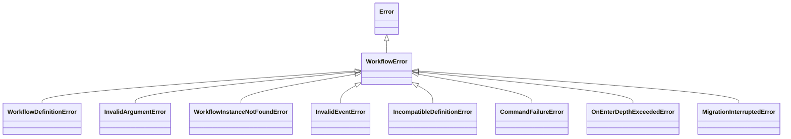

# Error Handling

The workflow runtime defines a hierarchy of error classes that represent different failure modes. All errors extend `WorkflowError`, which extends the native `Error`.

## Error Hierarchy


```mermaid
classDiagram
    Error <|-- WorkflowError
    WorkflowError <|-- WorkflowDefinitionError
    WorkflowError <|-- InvalidArgumentError
    WorkflowError <|-- WorkflowInstanceNotFoundError
    WorkflowError <|-- InvalidEventError
    WorkflowError <|-- IncompatibleDefinitionError
    WorkflowError <|-- CommandFailureError
    WorkflowError <|-- OnEnterDepthExceededError
    WorkflowError <|-- MigrationInterruptedError
```

## WorkflowError

Base class for all workflow errors.

```ts
class WorkflowError extends Error {
  constructor(message: string, cause?: unknown);
}
```

| Property  | Type      | Description                                        |
| --------- | --------- | -------------------------------------------------- |
| `message` | `string`  | Error description                                  |
| `cause`   | `unknown` | Optional underlying cause (standard `Error.cause`) |

**When thrown** (directly, not as a subclass):

- Optimistic locking failure — the instance was modified concurrently (e.g., `'Optimistic locking failure: workflow instance "..." was modified concurrently (expected version 3)'`)
- Command not found in registry
- A COMMIT that PostgreSQL rolled back because an earlier statement in the transaction failed (its error was caught and swallowed) -- `@duraflows/pg` and `@duraflows/kysely` reject with `"COMMIT was rolled back by PostgreSQL because an earlier statement in the transaction failed"` for a transaction they own (the runner's, or `transaction()`). Nothing was persisted and no observers fire.
- `listDefinitionVersions()` or `migrateInstances()` without a `definitionStore`, and `migrateInstances()` without `instanceUuids` when the instance store has no `findInstanceUuids`

A missing instance throws the subclass [`WorkflowInstanceNotFoundError`](#workflowinstancenotfounderror), so an `instanceof WorkflowError` check also catches it:

```ts
try {
  await runtime.triggerEvent({ workflowInstanceUuid: "nonexistent", ... });
} catch (err) {
  if (err instanceof WorkflowError) {
    console.error(err.message);
    // 'Workflow instance "nonexistent" not found'
  }
}
```

## WorkflowDefinitionError

Thrown when a workflow definition is invalid or not found.

```ts
class WorkflowDefinitionError extends WorkflowError {
  readonly workflowName: string;
  constructor(workflowName: string, message: string);
}
```

| Property       | Type     | Description                             |
| -------------- | -------- | --------------------------------------- |
| `workflowName` | `string` | The workflow name that caused the error |

**When thrown:**

- Registering a duplicate workflow name via `InMemoryDefinitionRegistry.register()`
- Validation failure during `register()` (e.g., invalid state references, missing target states, unknown command names, a `version` that isn't a positive safe integer)
- Compilation failure during `register()` (e.g., non-existent target/error state in finita process)
- Looking up a workflow that doesn't exist in the registry (via `get()`)
- `initialize()` finding that a known `(workflowName, version)` pair's stored content hash differs from the registered definition's — i.e., the definition's content changed without its `version` being bumped. _(v7.2.0)_ The same check also runs when an instance is stamped with the registered version — inside `createInstance()`'s transaction, and when a legacy or `"latest"`-policy instance adopts the latest version in `triggerEvent()` or the timeout sweep — so `createInstance()` and `triggerEvent()` can throw it too, not only `initialize()`. The timeout sweep doesn't throw it: it catches it like any other per-instance failure (the instance lands in `failed` and goes through retry/parking), and a migration whose `toVersion` is the registered version reports it in that instance's `result.failed` entry
- _(v7.2.0)_ `migrateInstances()` finding that the target version's stored snapshot differs from the copy the call loaded (`stored version <v> differs from the copy loaded earlier ...`) — reported per instance in `result.failed`, not thrown
- `initialize()`'s startup executability check (`onUnresolvable: "fail"`, the default): a stored definition version that still has active instances references a command or guard that is not registered, or its snapshot is structurally invalid
- A pinned instance resolving to a stored version that is missing from the definition store, or whose stored snapshot fails structural validation
- Startup validation in NestJS: a command name referenced in a workflow definition has no registered implementation (neither via `@WorkflowCommand` decorator nor explicit `commands` array)

```ts
try {
  await runtime.createInstance({ workflowName: "nonexistent", ... });
} catch (err) {
  if (err instanceof WorkflowDefinitionError) {
    console.error(err.workflowName); // "nonexistent"
    console.error(err.message);      // 'Workflow "nonexistent": Workflow not found in registry'
  }
}
```

**Validation errors include details:**

```ts
try {
  // Validation happens at registration time, not at runtime
  definitionRegistry.register({
    name: "bad",
    initialState: "missing",
    states: { start: {} },
  });
} catch (err) {
  if (err instanceof WorkflowDefinitionError) {
    console.error(err.message);
    // 'Workflow "bad": Invalid definition: Initial state "missing" does not exist in states'
  }
}
```

## InvalidArgumentError

Thrown when a caller passes an invalid numeric argument to a public runtime API.

```ts
class InvalidArgumentError extends WorkflowError {
  constructor(message: string);
}
```

**When thrown:**

- `runtime.processExpiredWorkflows({ limit })` — `limit` must be a positive safe integer
- `runtime.getHistory(uuid, { limit, offset })` — `limit` must be a positive safe integer; `offset` must be a non-negative safe integer
- `new WorkflowRuntime({ maxOnEnterDepth })` — `maxOnEnterDepth` must be a positive safe integer
- `new WorkflowRuntime({ onUnresolvable })` — must be `"fail"` or `"warn"` when provided
- `runtime.migrateInstances(input)` — its upfront validation (`fromVersion`/`toVersion`/`limit`, `states`/`excludeStates`, `cursor`, `stateMapping`); see [`migrateInstances()`](./core-runtime.md#migrateinstances)

Message shape: `"<name> must be a positive integer, got <value>"` for positive-only arguments (`limit`, `maxOnEnterDepth`), or `"<name> must be a non-negative integer, got <value>"` for `offset`. `onUnresolvable`'s message is `onUnresolvable must be "fail" or "warn", got <value>`.

```ts
try {
  await runtime.processExpiredWorkflows({ limit: -5 });
} catch (err) {
  if (err instanceof InvalidArgumentError) {
    console.error(err.message);
    // 'limit must be a positive integer, got -5'
  }
}
```

**How to fix:** Pass a positive safe integer (or a non-negative safe integer for `offset`). `NaN`, `Infinity`, non-integers, and out-of-range values are all rejected.

## WorkflowInstanceNotFoundError

Thrown when an operation that needs an existing instance can't find its UUID.

```ts
class WorkflowInstanceNotFoundError extends WorkflowError {
  readonly workflowInstanceUuid: string;
  constructor(workflowInstanceUuid: string);
}
```

| Property               | Type     | Description             |
| ---------------------- | -------- | ----------------------- |
| `workflowInstanceUuid` | `string` | The UUID that was given |

**When thrown:** `triggerEvent()`, `getAvailableEvents()` and `rearmTimeout()` with a UUID that doesn't exist. The message is `Workflow instance "<uuid>" not found`. (`getInstance()` returns `null` instead.) In `@duraflows/nestjs`, `WorkflowExceptionFilter` maps it to **404 Not Found**.

## InvalidEventError

Thrown when an event does not exist on the current state.

```ts
class InvalidEventError extends WorkflowError {
  readonly workflowInstanceUuid: string;
  readonly currentState: string;
  readonly eventName: string;
  constructor(workflowInstanceUuid: string, currentState: string, eventName: string);
}
```

| Property               | Type     | Description                       |
| ---------------------- | -------- | --------------------------------- |
| `workflowInstanceUuid` | `string` | The instance UUID                 |
| `currentState`         | `string` | The current state of the instance |
| `eventName`            | `string` | The event that was attempted      |

**When thrown:** `triggerEvent()` is called with an event name that is not defined on the instance's current state.

```ts
try {
  await runtime.triggerEvent({
    workflowInstanceUuid: instance.uuid,
    eventName: "Ship", // not available in "new" state
  });
} catch (err) {
  if (err instanceof InvalidEventError) {
    console.error(err.currentState); // "new"
    console.error(err.eventName); // "Ship"
  }
}
```

## IncompatibleDefinitionError

Thrown when an instance's current state does not exist in the definition that governs it.

```ts
class IncompatibleDefinitionError extends WorkflowError {
  readonly workflowInstanceUuid: string;
  readonly workflowName: string;
  readonly currentState: string;
  readonly version: number;
  constructor(workflowInstanceUuid: string, workflowName: string, currentState: string, version: number);
}
```

| Property               | Type     | Description                                            |
| ---------------------- | -------- | ------------------------------------------------------ |
| `workflowInstanceUuid` | `string` | The instance UUID                                      |
| `workflowName`         | `string` | The workflow name                                      |
| `currentState`         | `string` | The instance's current state                           |
| `version`              | `number` | The definition version that does not define that state |

**When thrown:** an instance's governing definition has `versionPolicy: "latest"` and its current state is not an own key of the latest registered definition's `states`. See [Definition versions](./workflow-definitions.md#definition-versions). An event that no longer exists on a state the definition _does_ still have throws `InvalidEventError` instead — this error is specifically about a missing state.

```ts
try {
  await runtime.triggerEvent({
    workflowInstanceUuid: instance.uuid,
    eventName: "Ship",
  });
} catch (err) {
  if (err instanceof IncompatibleDefinitionError) {
    console.error(err.currentState); // the state the latest definition no longer has
    console.error(err.version); // the latest definition's version
  }
}
```

**How to fix:** either keep the old state in the definition until every instance has moved off it, or switch the definition back to `versionPolicy: "pinned"` (the default) so in-flight instances keep executing the version they were stamped with instead of the latest one.

In `@duraflows/nestjs`, the bundled `WorkflowExceptionFilter` maps this to **409 Conflict**, the same as `InvalidEventError`.

## CommandFailureError

Thrown when a **mandatory** command returns `{ ok: false }` and the event has no `errorState` to transition to. Best-effort commands never trigger this error — see [Best-Effort Commands](#best-effort-commands).

```ts
class CommandFailureError extends WorkflowError {
  readonly workflowInstanceUuid: string;
  readonly eventName: string;
  readonly commandName: string;
  readonly result: CommandResult;
  constructor(workflowInstanceUuid: string, eventName: string, commandName: string, result: CommandResult);
}
```

| Property               | Type            | Description                         |
| ---------------------- | --------------- | ----------------------------------- |
| `workflowInstanceUuid` | `string`        | The instance UUID                   |
| `eventName`            | `string`        | The event being processed           |
| `commandName`          | `string`        | The command that failed             |
| `result`               | `CommandResult` | The failure result from the command |

**When thrown:** A mandatory command returns `{ ok: false }` and the event does not define an `errorState`. Since there's no error state to transition to, the failure is surfaced as an exception.

```ts
// Event definition:
// PaymentReceived: { targetState: "paid" }  // no errorState!

// Command returns { ok: false }

try {
  await runtime.triggerEvent({
    workflowInstanceUuid: instance.uuid,
    eventName: "PaymentReceived",
    subject: order,
  });
} catch (err) {
  if (err instanceof CommandFailureError) {
    console.error(err.commandName); // "chargePayment"
    console.error(err.result.code); // "INSUFFICIENT_FUNDS"
    console.error(err.result.message); // "Card declined"
  }
}
```

**How to fix:** Add an `errorState` to the event definition so command failures transition gracefully instead of throwing:

```ts
PaymentReceived: {
  targetState: "paid",
  errorState: "payment_failed", // now failures transition here instead of throwing
  commands: [{ name: "chargePayment" }],
}
```

## OnEnterDepthExceededError

Thrown when an onEnter auto-transition chain exceeds the maximum allowed depth.

```ts
class OnEnterDepthExceededError extends WorkflowError {
  readonly workflowInstanceUuid: string;
  readonly stateName: string;
  readonly depth: number;
  constructor(workflowInstanceUuid: string, stateName: string, depth: number);
}
```

| Property               | Type     | Description                                 |
| ---------------------- | -------- | ------------------------------------------- |
| `workflowInstanceUuid` | `string` | The instance UUID                           |
| `stateName`            | `string` | The state where the depth limit was reached |
| `depth`                | `number` | The maximum depth that was exceeded         |

**When thrown:** An onEnter chain exceeds the configured `maxOnEnterDepth` (default 10). This is a safety guard against infinite loops caused by misconfigured onEnter chains.

```ts
try {
  await runtime.triggerEvent({
    workflowInstanceUuid: instance.uuid,
    eventName: "Start",
  });
} catch (err) {
  if (err instanceof OnEnterDepthExceededError) {
    console.error(err.stateName); // state where depth was exceeded
    console.error(err.depth); // 10
  }
}
```

**How to fix:** Review the onEnter chain for unintended loops. The static cycle detector at registration time catches direct cycles, but complex chains with many hops (without cycles) can still exceed the depth limit. Increase `maxOnEnterDepth` in `WorkflowRuntimeOptions` if the chain depth is intentional.

## MigrationInterruptedError

_(v7.2.0)_ Thrown by `migrateInstances()` when _listing_ candidates fails partway through.

```ts
class MigrationInterruptedError extends WorkflowError {
  readonly result: MigrateInstancesResult;
}
```

| Property | Type                     | Description                                                                          |
| -------- | ------------------------ | ------------------------------------------------------------------------------------ |
| `result` | `MigrateInstancesResult` | Everything done before the interruption; `result.nextCursor` is where to resume from |
| `cause`  | `unknown`                | The original error (inherited from `WorkflowError`)                                  |

**When thrown:** the instance store's `findInstanceUuids` rejects, or returns a page that isn't strictly ascending past the cursor or that contains an entry that isn't a non-empty string. Never for a per-instance problem (a throwing `transformContext`, an optimistic-lock conflict, a database error migrating one instance) — those land in `result.failed` and the batch continues. `result.nextCursor` is the last UUID examined, or the input `cursor` (`null` without one) if none was examined yet.

**How to fix:** test `err.cause instanceof <YourStoreError>`, not `err`, to see what failed. Resume with `cursor: err.result.nextCursor ?? undefined`, keeping `err.result`'s `skipped` and `failed` (a resumed call won't examine them again), and cap consecutive retries (see [Catch Specific Errors](#catch-specific-errors)). A store rejection is usually transient; a bad page means the adapter's `findInstanceUuids` breaks its ordering contract. See [Migrating instances](./workflow-definitions.md#migrating-instances) for the full batch loop.

## Guard rejection vs. invalid event

`InvalidEventError` is thrown when an event isn't even registered for the current state — a definition-level mismatch. **Guard rejection is different**: the event is registered, but its guard returned `false` at runtime. That isn't an error; it's a normal outcome surfaced via `result.outcome === "guard-rejected"` and `result.rejectedBy`. Callers should branch on `outcome` to distinguish success, command failure, and guard rejection rather than catching exceptions.

## Command Exceptions vs. Command Failures

There are two distinct failure modes for commands:

### Controlled Failure (returns `{ ok: false }`)

The command returns a structured failure. This is a **business failure** -- the command executed but the operation could not be completed (e.g., payment declined, inventory unavailable).

- If `errorState` is defined: workflow transitions to `errorState`, `outcome` is `"failure"`, history is recorded
- If `errorState` is not defined: throws `CommandFailureError`, no transition, transaction rolls back

### Uncontrolled Failure (throws an exception)

The command throws an error. This is a **technical failure** -- the command could not execute at all (e.g., network error, database crash).

For **mandatory** commands:

- The exception propagates through `triggerEvent()`
- No state transition occurs
- No history record is created
- The transaction rolls back completely
- The workflow instance remains in its previous state

For **best-effort** commands, the runtime catches the exception instead of propagating it -- see [Best-Effort Commands](#best-effort-commands).

### Decision Guide

| Scenario                 | Command should...               | Event definition                    |
| ------------------------ | ------------------------------- | ----------------------------------- |
| Payment declined         | Return `{ ok: false }`          | Include `errorState`                |
| API timeout              | Throw or return `{ ok: false }` | Include `errorState` if recoverable |
| Database connection lost | Let the exception propagate     | N/A (infrastructure failure)        |
| Validation failure       | Return `{ ok: false }`          | Include `errorState`                |
| Bug in command code      | Let the exception propagate     | N/A (fix the bug)                   |
| Metrics / notification   | Use `bestEffort = true`         | No `errorState` needed              |

## Best-Effort Commands

A command is best-effort when it declares `readonly bestEffort = true` (class field) or `bestEffort: true` (object property). Best-effort commands have different failure semantics from mandatory commands:

| Outcome              | Mandatory command                            | Best-effort command                                             |
| -------------------- | -------------------------------------------- | --------------------------------------------------------------- |
| `{ ok: true }`       | Chain continues                              | Chain continues                                                 |
| `{ ok: false, ... }` | Chain aborts (or routes to `errorState`)     | Chain continues; result recorded                                |
| Throws               | Exception propagates; transaction rolls back | Exception caught; converted to `CommandResult`; chain continues |

### Thrown Exception Shape

When a best-effort command throws, the runtime catches the exception and builds a `CommandResult` with a serializable error shape:

```typescript
{
  ok: false,
  code: "BEST_EFFORT_THROWN",
  message: string,  // extracted from error.message or String(error)
  error: {
    name: string,    // error.name for Error instances; "UnknownError" otherwise
    message: string, // error.message or String(value)
    stack?: string,  // only present for Error instances with a stack
  }
}
```

The `error` field is always a serializable shape — it is **not** the raw thrown value. This matters because `CommandResult` is JSON-serialized by persistence backends (pg, kysely). Raw `Error` objects persist poorly (`JSON.stringify(new Error(...))` returns `"{}"`), and non-`Error` throws (strings, BigInts, circular objects) can crash serialization entirely. The sanitized shape is safe across all persistence backends.

Note: the `error` field on the `CommandResult` interface has type `unknown` (for backward compatibility with user code that populates `error` directly from an `ok: false` return). The runtime-synthesized best-effort shape is always `{ name, message, stack? }` as described above.

### Intent

Use `bestEffort` for side effects that should **not** block the workflow — metrics emission, notifications, cache warming, auditing. Never use it for state-critical operations.

### Example

```typescript
class WarmCacheCommand implements WorkflowCommand {
  readonly bestEffort = true; // cache failures shouldn't block the workflow

  async execute(_subject: unknown, ctx: WorkflowExecutionContext): Promise<CommandResult> {
    try {
      await cache.put(ctx.toState, ctx.context);
      return { ok: true };
    } catch (error) {
      // Still return the error shape so history retains context:
      return { ok: false, code: "CACHE_WARM_FAILED", message: String(error) };
    }
  }
}
```

If `WarmCacheCommand.execute()` throws instead of catching, the runtime catches it on behalf of the command and the chain still continues.

### Interaction with `errorState`

`errorState` and `bestEffort` are independent mechanisms:

- `errorState` applies to **mandatory** command failures in an `onEnter` chain. When a mandatory command returns `ok: false` and the state has an `errorState`, the runtime transitions to `errorState` instead of throwing `CommandFailureError`. This is per-hop routing — the chain's aggregate `outcome` becomes `"failure"` once an `errorState` hop occurs. A mandatory command that **throws** never routes to `errorState`: the exception propagates and the transaction rolls back (see [Uncontrolled Failure](#uncontrolled-failure-throws-an-exception)).
- `bestEffort` applies to **individual commands** regardless of whether the state has `errorState`. A best-effort failure never triggers `errorState` routing because, from the chain's perspective, it is not a failure.

## Error Handling Patterns

### Catch Specific Errors

```ts
import {
  WorkflowError,
  WorkflowInstanceNotFoundError,
  InvalidEventError,
  IncompatibleDefinitionError,
  CommandFailureError,
  OnEnterDepthExceededError,
} from "@duraflows/core";

try {
  const result = await runtime.triggerEvent(input);
} catch (err) {
  if (err instanceof WorkflowInstanceNotFoundError) {
    return { status: 404, message: err.message };
  }
  if (err instanceof InvalidEventError) {
    // Event not available on current state -- 409, like the bundled NestJS filter
    return { status: 409, message: `Event "${err.eventName}" is not available in state "${err.currentState}"` };
  }
  if (err instanceof IncompatibleDefinitionError) {
    // Instance's state doesn't exist in the latest ("latest"-policy) definition
    return { status: 409, message: err.message };
  }
  if (err instanceof CommandFailureError) {
    // Command failed with no error state -- 422 is a choice; the bundled NestJS filter answers 500
    return { status: 422, message: `Command "${err.commandName}" failed: ${err.result.message}` };
  }
  if (err instanceof OnEnterDepthExceededError) {
    // onEnter chain too deep -- likely a configuration issue
    return { status: 500, message: err.message };
  }
  if (err instanceof WorkflowError) {
    // Anything else -- an optimistic-lock conflict, a COMMIT PostgreSQL rolled back,
    // a definition error -- is not the caller's fault: log it and answer 500 (or rethrow).
    console.error(err, err.cause);
    return { status: 500, message: "Internal server error" };
  }
  // Infrastructure error
  throw err;
}
```

`migrateInstances()` is usually run from a script rather than a request handler; handle its [`MigrationInterruptedError`](#migrationinterruptederror) by resuming from `err.result.nextCursor`:

```ts
import { MigrationInterruptedError } from "@duraflows/core";

try {
  const result = await runtime.migrateInstances({ ...input, limit: 500, cursor });
} catch (err) {
  if (err instanceof MigrationInterruptedError) {
    // Listing candidates failed: err.cause is the original error, err.result the partial result.
    cursor = err.result.nextCursor ?? undefined; // resume here, keeping err.result.skipped/failed
  } else {
    throw err;
  }
}
```

### NestJS Exception Filter

`@duraflows/nestjs` already ships a filter, `WorkflowExceptionFilter`, which its REST controllers apply and which you can register for your own controllers too (e.g. `app.useGlobalFilters(new WorkflowExceptionFilter())`). Its status mapping is listed in [NestJS Integration: Error Responses](./nestjs-integration.md#error-responses). Prefer it; write your own only to change that mapping. The custom filter below keeps the bundled mapping and deliberately differs in one place: it answers `CommandFailureError` with 422 instead of the bundled 500.

```ts
import { ExceptionFilter, Catch, ArgumentsHost, HttpStatus, Logger } from "@nestjs/common";
import {
  WorkflowError,
  WorkflowInstanceNotFoundError,
  InvalidEventError,
  IncompatibleDefinitionError,
  InvalidArgumentError,
  CommandFailureError,
} from "@duraflows/core";

@Catch(WorkflowError)
export class MyWorkflowExceptionFilter implements ExceptionFilter {
  private readonly logger = new Logger(MyWorkflowExceptionFilter.name);

  catch(exception: WorkflowError, host: ArgumentsHost) {
    const response = host.switchToHttp().getResponse();

    let status = HttpStatus.INTERNAL_SERVER_ERROR;
    if (exception instanceof WorkflowInstanceNotFoundError) status = HttpStatus.NOT_FOUND;
    if (exception instanceof InvalidEventError || exception instanceof IncompatibleDefinitionError) {
      status = HttpStatus.CONFLICT;
    }
    if (exception instanceof InvalidArgumentError) status = HttpStatus.BAD_REQUEST;
    if (exception instanceof CommandFailureError) status = HttpStatus.UNPROCESSABLE_ENTITY; // bundled: 500

    if (status === HttpStatus.INTERNAL_SERVER_ERROR) {
      // Don't echo internal messages to clients: log the error (and its cause) instead.
      this.logger.error(exception.message, (exception.cause instanceof Error ? exception.cause : exception).stack);
    }
    response.status(status).send({
      statusCode: status,
      error: exception.name,
      message: status === HttpStatus.INTERNAL_SERVER_ERROR ? "Internal server error" : exception.message,
    });
  }
}
```
