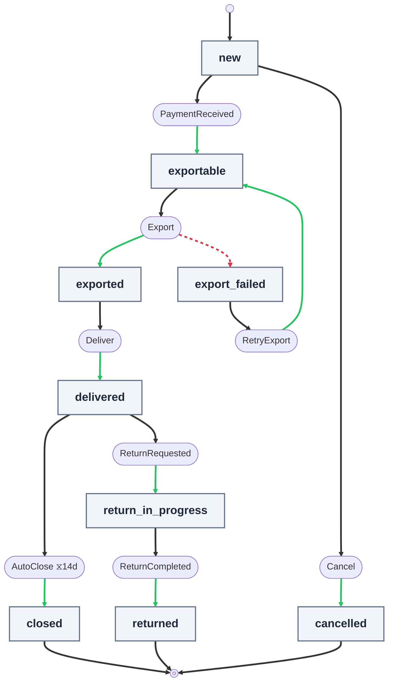

# Workflow Definitions

A workflow definition is a plain TypeScript object that describes the states, events, commands, timeouts, and context of a workflow.

## WorkflowDefinition

```ts
interface WorkflowDefinition {
  name: string;
  version?: number;
  initialState: string;
  states: Record<string, WorkflowStateDefinition>;
}
```

| Property       | Type                                      | Required | Description                                                                                                                                    |
| -------------- | ----------------------------------------- | -------- | ---------------------------------------------------------------------------------------------------------------------------------------------- |
| `name`         | `string`                                  | Yes      | Unique identifier for the workflow. Must be non-empty.                                                                                         |
| `version`      | `number`                                  | No       | Explicit definition version, defaulting to `1` when omitted. Must be a positive safe integer. See [Definition versions](#definition-versions). |
| `initialState` | `string`                                  | Yes      | Name of the starting state. Must exist in `states`.                                                                                            |
| `states`       | `Record<string, WorkflowStateDefinition>` | Yes      | Map of state names to state definitions. At least one state required.                                                                          |

### Example

```ts
const workflow: WorkflowDefinition = {
  name: "order",
  initialState: "new",
  states: {
    new: {/* ... */},
    processing: {/* ... */},
    completed: {},
  },
};
```

## Definition versions

Every definition carries an explicit `version` (a positive integer, defaulting
to `1` when omitted):

```ts
const orderWorkflow: WorkflowDefinition = {
  name: "order",
  version: 2,
  initialState: "new",
  states: {/* ... */},
};
```

Bump `version` whenever the definition's content changes. At startup,
`WorkflowRuntime.initialize()` (invoked automatically by the NestJS module,
and lazily by the first operation otherwise) snapshots each registered
definition into the `workflow_definitions` table and compares content hashes:
re-registering a known version with changed content fails fast with
`WorkflowDefinitionError` instead of silently running drifted definitions.
The content hash deliberately excludes `version` itself, so relabeling a
version without changing anything else never trips the guard.

Instances record the definition version that governs them
(`WorkflowInstance.definitionVersion`), and every history row records the
version that governed that transition. Instances created before versioning
existed have `definitionVersion: null` and are stamped on their next
transition. **In the current release, resolution behavior is unchanged: all
instances still execute the currently registered definition regardless of
the version they were stamped with.** The version stamp is provenance only
-- version-pinned execution is planned for a later release.

## WorkflowStateDefinition

```ts
interface WorkflowStateDefinition {
  context?: Record<string, unknown>;
  events?: Record<string, WorkflowEventDefinition>;
  onEnter?: WorkflowOnEnterDefinition;
  metadata?: Record<string, unknown>;
}
```

| Property   | Type                                      | Required | Description                                                  |
| ---------- | ----------------------------------------- | -------- | ------------------------------------------------------------ |
| `context`  | `Record<string, unknown>`                 | No       | Values merged into workflow context when entering this state |
| `events`   | `Record<string, WorkflowEventDefinition>` | No       | Events available from this state                             |
| `onEnter`  | `WorkflowOnEnterDefinition`               | No       | Auto-fire behavior when this state is entered                |
| `metadata` | `Record<string, unknown>`                 | No       | Arbitrary state metadata                                     |

A state with no `events` is a **terminal state** -- the workflow cannot progress further from it.

When a workflow enters a state, the `context` values defined on that state are **merged** into the instance's context (existing keys are preserved, matching keys are overwritten). This is useful for setting state-derived values like status flags.

### Example

```ts
states: {
  processing: {
    context: { status: "in_progress" },
    events: {
      Complete: { targetState: "completed" },
      Fail: { targetState: "failed" },
    },
    metadata: { displayName: "Processing" },
  },
  completed: {
    context: { status: "done" },
  },
}
```

## WorkflowOnEnterDefinition

Defines behavior that fires automatically when a workflow enters a state. This enables running commands on entry and chaining state transitions (e.g., an intermediate state that auto-transitions after executing commands).

```ts
interface WorkflowOnEnterDefinition {
  targetState?: string;
  errorState?: string;
  commands?: WorkflowCommandRef[];
  metadata?: Record<string, unknown>;
}
```

| Property      | Type                      | Required | Description                                                                       |
| ------------- | ------------------------- | -------- | --------------------------------------------------------------------------------- |
| `targetState` | `string`                  | No       | State to transition to after commands succeed. Must reference a valid state name. |
| `errorState`  | `string`                  | No       | State to transition to if a command fails. Must reference a valid state name.     |
| `commands`    | `WorkflowCommandRef[]`    | No       | Ordered list of commands to execute on entry.                                     |
| `metadata`    | `Record<string, unknown>` | No       | Arbitrary metadata.                                                               |

### onEnter Behavior

| Scenario                                 | Outcome                                               |
| ---------------------------------------- | ----------------------------------------------------- |
| Commands succeed + `targetState` defined | Transitions to `targetState`                          |
| Commands succeed + no `targetState`      | Stays in current state (commands ran as side effects) |
| Command fails + `errorState` defined     | Transitions to `errorState`                           |
| Command fails + no `errorState`          | Throws `CommandFailureError`, transaction rolls back  |
| No commands + `targetState` defined      | Transitions to `targetState` immediately              |

### Chaining

If the `targetState` (or `errorState`) also has an `onEnter`, the chain continues automatically. Each hop produces its own history record with `eventName: "onEnter"` and `triggerMetadata: { source: "onEnter" }`.

The entire chain runs inside a single transaction. `triggerEvent()` returns only the **final landing state** -- intermediate hops are visible in the history table.

A runtime depth guard (configurable via `maxOnEnterDepth`, default 10) prevents infinite chains. Static cycle detection at registration time also catches cycles in `onEnter` graphs.

### Examples

**Auto-transition (gateway state):**

```ts
states: {
  validating: {
    onEnter: {
      targetState: "validated",
      commands: [{ name: "runValidation" }],
    },
  },
  validated: {},
}
```

**Side-effect only (no transition):**

```ts
states: {
  active: {
    onEnter: {
      commands: [{ name: "sendActivationNotification" }],
    },
    events: { /* ... */ },
  },
}
```

**Error branching:**

```ts
states: {
  processing: {
    onEnter: {
      targetState: "done",
      errorState: "failed",
      commands: [{ name: "processPayment" }],
    },
  },
  done: {},
  failed: {},
}
```

**Multi-hop chain:**

```ts
states: {
  initializing: {
    onEnter: {
      targetState: "provisioning",
      commands: [{ name: "allocateResources" }],
    },
  },
  provisioning: {
    onEnter: {
      targetState: "ready",
      commands: [{ name: "configureService" }],
    },
  },
  ready: { /* terminal or has events */ },
}
```

## WorkflowEventDefinition

```ts
interface WorkflowEventDefinition {
  targetState?: string;
  errorState?: string;
  commands?: WorkflowCommandRef[];
  timeout?: WorkflowTimeoutDefinition;
  metadata?: Record<string, unknown>;
}
```

| Property      | Type                        | Required | Description                                                                                                             |
| ------------- | --------------------------- | -------- | ----------------------------------------------------------------------------------------------------------------------- |
| `targetState` | `string`                    | No       | State to transition to on success. Must reference a valid state name.                                                   |
| `errorState`  | `string`                    | No       | State to transition to on command failure. Must reference a valid state name.                                           |
| `commands`    | `WorkflowCommandRef[]`      | No       | Ordered list of commands to execute when the event is triggered.                                                        |
| `guard`       | `WorkflowGuardRef`          | No       | Optional precondition. Evaluated before commands run; if it returns `false`, no commands run and no transition happens. |
| `timeout`     | `WorkflowTimeoutDefinition` | No       | Timeout configuration for automatic triggering. At most one event per state may define a timeout.                       |
| `metadata`    | `Record<string, unknown>`   | No       | Arbitrary event metadata.                                                                                               |

An event must define at least one of `targetState`, `errorState`, or `commands`. A completely empty event is rejected as a declarative no-op.

### WorkflowGuardRef

```ts
interface WorkflowGuardRef {
  name: string; // resolved against the WorkflowGuardRegistry
  metadata?: Record<string, unknown>; // surfaces as ctx.commandMetadata inside evaluate()
}
```

A guard is a pure predicate that decides whether an event may fire. Register a `WorkflowGuard` (matching `name`) in the runtime's guard registry; the executor calls `evaluate(subject, ctx)` before any commands. A `false` result short-circuits the event with `outcome: "guard-rejected"` and no state change.

> **Guards must be pure.** A guard's `evaluate` should be a read-only predicate: inspect the subject and context, return a boolean. Do not mutate the subject, do not call external services, do not write to databases. Side effects belong in commands, which run after the guard passes. Guards may be re-evaluated (for example, if a timeout sweep retries an instance) and any side effects performed inside them will repeat without compensation. If you need to call an external system to make the decision, do that work in a command on a prior transition and stash the result in `context` for the guard to read.

```ts
const definition: WorkflowDefinition = {
  name: "lifecycle-wf",
  initialState: "draft",
  states: {
    draft: {
      events: {
        submit: {
          guard: { name: "submitterIsVerified" },
          targetState: "submitted",
          commands: [{ name: "validate" }],
        },
      },
    },
    submitted: {},
  },
};
```

### Event Shapes

The runtime supports several event shapes:

- **Transitioning event** (`targetState` + optionally `commands`): runs commands, then transitions to `targetState` on success. On failure, routes to `errorState` if defined, else throws `CommandFailureError`.
- **Command-only event** (`commands`, no `targetState` or `errorState`): runs commands, stays in current state on success. Throws `CommandFailureError` if a mandatory command fails.
- **Failure-only event** (`errorState` + `commands`, no `targetState`): stays in current state on success, routes to `errorState` on command failure.
- **Transitioning with recovery** (`targetState` + `errorState` + `commands`): transitions to `targetState` on success, routes to `errorState` on failure.

### Event Outcome Rules

| Scenario                                                  | Outcome   | Transition                                                  |
| --------------------------------------------------------- | --------- | ----------------------------------------------------------- |
| No commands defined                                       | `success` | Transitions to `targetState` (if defined), else stays put   |
| All commands return `{ ok: true }`                        | `success` | Transitions to `targetState` (if defined), else stays put   |
| Any command returns `{ ok: false }`, `errorState` defined | `failure` | Transitions to `errorState`                                 |
| Any command returns `{ ok: false }`, no `errorState`      | --        | Throws `CommandFailureError`, no transition                 |
| Any command throws an exception                           | --        | Exception propagates, no transition, transaction rolls back |

### Examples

**Simple transitioning event (no commands):**

```ts
PaymentReceived: {
  targetState: "paid",
}
```

**Event with commands and error branching:**

```ts
Export: {
  targetState: "exported",
  errorState: "export_failed",
  commands: [
    { name: "validateInventory" },
    { name: "sendToWarehouse" },
    { name: "notifyCustomer" },
  ],
}
```

Commands execute sequentially. If `validateInventory` fails, `sendToWarehouse` and `notifyCustomer` are skipped and the workflow transitions to `export_failed`.

**Command-only event (no state change on success):**

```ts
Ping: {
  commands: [{ name: "emitPing" }],
}
```

The workflow stays in its current state after the event. Use this for side effects that don't change state.

**Failure-only event (error routing, no success transition):**

```ts
TryProcess: {
  errorState: "failed",
  commands: [{ name: "riskyOperation" }],
}
```

On success the workflow stays in its current state; on failure it routes to `failed`.

**Timeout event:**

```ts
AutoClose: {
  targetState: "closed",
  timeout: { afterDays: 30 },
}
```

## WorkflowCommandRef

```ts
interface WorkflowCommandRef {
  name: string;
  metadata?: Record<string, unknown>;
}
```

| Property   | Type                      | Required | Description                                                                                                                                                                                                                                                                                    |
| ---------- | ------------------------- | -------- | ---------------------------------------------------------------------------------------------------------------------------------------------------------------------------------------------------------------------------------------------------------------------------------------------- |
| `name`     | `string`                  | Yes      | Stable name that maps to a registered `WorkflowCommand` implementation. In NestJS, use the [`@WorkflowCommand` decorator](nestjs-integration.md#workflowcommand-decorator) or explicit `commands` array to register implementations. Without NestJS, use `InMemoryCommandRegistry.register()`. |
| `metadata` | `Record<string, unknown>` | No       | Arbitrary per-invocation metadata. Delivered to the command handler as `ctx.commandMetadata` (deep-cloned and deep-frozen). Each command in a chain receives its own copy, independent of any other command's metadata.                                                                        |

### Example

```ts
commands: [{ name: "chargePayment" }, { name: "sendReceipt", metadata: { template: "premium" } }];
```

## WorkflowTimeoutDefinition

```ts
interface WorkflowTimeoutDefinition {
  afterMinutes?: number;
  afterHours?: number;
  afterDays?: number;
}
```

All fields are **additive**. The total timeout duration is the sum of all defined fields.

| Property       | Type     | Multiplier | Description |
| -------------- | -------- | ---------- | ----------- |
| `afterMinutes` | `number` | 60,000     | Minutes     |
| `afterHours`   | `number` | 3,600,000  | Hours       |
| `afterDays`    | `number` | 86,400,000 | Days        |

The minimum granularity is minutes. Timeout processing depends on an external scheduler (cron job, NestJS `@Cron`, etc.) polling for expired instances, so sub-minute precision is not meaningful.

**Rules:**

- At least one field must be defined.
- All defined fields must be positive numbers.
- At most **one event per state** may define a timeout.

### Examples

```ts
// 30 minutes
timeout: { afterMinutes: 30 }

// 1 day and 12 hours
timeout: { afterDays: 1, afterHours: 12 }

// 3 days
timeout: { afterDays: 3 }
```

## Context and Metadata

Every workflow instance carries two data stores. Understanding the difference is essential:

### Metadata -- Immutable Identity

**Metadata** is set once at instance creation and never modified by the runtime. It answers: _"What domain entity does this workflow belong to?"_

```ts
const instance = await runtime.createInstance({
  workflowName: "order",
  metadata: { orderId: "ORD-123", customerId: "CUST-456" },
});

// instance.metadata → { orderId: "ORD-123", customerId: "CUST-456" }
// This never changes, no matter how many transitions occur.
```

Use metadata for lookup keys, external IDs, and anything that should remain constant for the lifetime of the instance. Commands can **read** metadata but cannot modify it.

Persisted in `workflow_instances.metadata_json`.

### Context -- Mutable Working Memory

**Context** is the workflow's mutable state that accumulates data over its lifetime. It has three sources:

1. **Seeded at creation** -- initial values passed via `createInstance({ context: { ... } })`
2. **Merged on state entry** -- values defined in `WorkflowStateDefinition.context` are merged when entering a state
3. **Written by commands** -- command handlers can read and write `context` during execution

```ts
// 1. Seeded at creation
const instance = await runtime.createInstance({
  workflowName: "order",
  context: { priority: "high" },
});
// context → { priority: "high", paymentStatus: "pending" }
//           (seeded value)        (merged from "new" state definition)

// 2. State definition merges on entry
states: {
  new: {
    context: { paymentStatus: "pending" },
  },
  paid: {
    context: { paymentStatus: "confirmed" },
  },
}

// 3. Commands write during execution
class ChargePaymentCommand implements WorkflowCommand<Order> {
  async execute(subject: Order, ctx: WorkflowExecutionContext) {
    const charge = await this.gateway.charge(subject.total);
    ctx.context.chargeId = charge.id;          // written to context
    ctx.context.chargedAt = ctx.now.toISOString();
    return { ok: true };
  }
}
```

**Merge order during a transition:**

1. Commands run and may mutate `context`
2. Workflow transitions to the new state
3. The new state's `context` values are merged on top

This means state-defined context values take precedence over command writes for the same key. If a command sets `paymentStatus = "processing"` and the target state defines `paymentStatus: "confirmed"`, the final value is `"confirmed"`.

Persisted in `workflow_instances.context_json`.

### Comparison

|                                   | Metadata                            | Context                                   |
| --------------------------------- | ----------------------------------- | ----------------------------------------- |
| **Purpose**                       | Identity / lookup keys              | Working memory                            |
| **Set at creation**               | Yes                                 | Yes                                       |
| **Modified by state transitions** | No                                  | Yes (state context merged)                |
| **Writable by commands**          | No (read-only)                      | Yes                                       |
| **Typical contents**              | `orderId`, `customerId`, `tenantId` | `paymentStatus`, `chargeId`, `retryCount` |
| **Persisted in**                  | `metadata_json`                     | `context_json`                            |

### Accessing from Commands

Both `context` and `metadata` are available on the `WorkflowExecutionContext` passed to every command:

```ts
class MyCommand implements WorkflowCommand<Order> {
  async execute(subject: Order, ctx: WorkflowExecutionContext) {
    // Read immutable metadata
    const orderId = ctx.metadata.orderId as string;

    // Read and write mutable context
    const retryCount = (ctx.context.retryCount as number) ?? 0;
    ctx.context.retryCount = retryCount + 1;
    ctx.context.lastAttempt = ctx.now.toISOString();

    return { ok: true };
  }
}
```

## Validation Rules

The `WorkflowValidator` checks:

1. `name` must be non-empty
2. `states` must contain at least one entry
3. `initialState` must exist in `states`
4. Every `targetState` and `errorState` must reference valid state names (in events and `onEnter`)
5. Events must define at least `targetState`
6. At most one event per state may define a `timeout`
7. Timeout duration fields must be positive numbers
8. At least one timeout duration field must be defined
9. All command names referenced in events and `onEnter` must exist in the set of known commands (when `knownCommandNames` validation option is provided)
10. No cycles in the `onEnter` graph (static DFS-based cycle detection)

Validation runs automatically at **registration time** when calling `InMemoryDefinitionRegistry.register()` (if a `WorkflowValidator` was provided as a constructor dependency). Invalid definitions fail at startup, not at runtime.

Additionally, if `knownCommandNames` is provided in the validation options, the validator cross-checks all command name references against the set of registered commands (rule 9).

The cycle detection (rule 10) builds a directed graph from each state's `onEnter.targetState` and `onEnter.errorState` edges and reports the first cycle found (e.g., `"Cycle detected in onEnter chain: A -> B -> A"`).

## Complete Example



```ts
import type { WorkflowDefinition } from "@duraflows/core";

export const orderWorkflow: WorkflowDefinition = {
  name: "order",
  initialState: "new",
  states: {
    new: {
      context: { paymentStatus: "pending", shipmentStatus: "reserved", isActive: true },
      events: {
        PaymentReceived: {
          targetState: "exportable",
        },
        Cancel: {
          targetState: "cancelled",
        },
      },
    },
    exportable: {
      context: { paymentStatus: "paid", shipmentStatus: "exportable" },
      events: {
        Export: {
          targetState: "exported",
          errorState: "export_failed",
          commands: [{ name: "exportToWarehouse" }, { name: "issueVoucher" }],
        },
      },
    },
    exported: {
      context: { shipmentStatus: "shipped" },
      events: {
        Deliver: { targetState: "delivered" },
      },
    },
    delivered: {
      context: { shipmentStatus: "delivered", isActive: false },
      events: {
        AutoClose: {
          targetState: "closed",
          timeout: { afterDays: 14 },
        },
        ReturnRequested: {
          targetState: "return_in_progress",
        },
      },
    },
    closed: {},
    cancelled: {
      context: { isActive: false },
    },
    export_failed: {
      events: {
        RetryExport: {
          targetState: "exportable",
        },
      },
    },
    return_in_progress: {
      events: {
        ReturnCompleted: {
          targetState: "returned",
          commands: [{ name: "processRefund" }],
        },
      },
    },
    returned: {
      context: { isActive: false },
    },
  },
};
```
