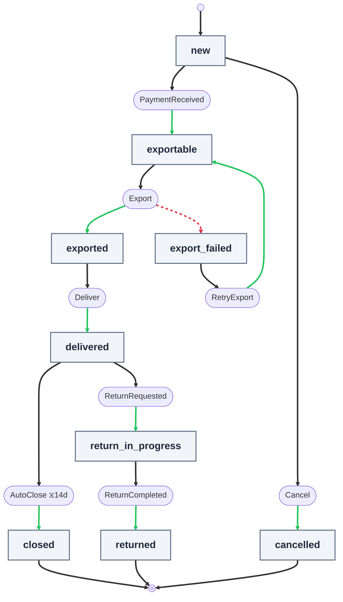

# Workflow Definitions

A workflow definition is a plain TypeScript object that describes the states, events, commands, timeouts, and context of a workflow.

## WorkflowDefinition

```ts
interface WorkflowDefinition {
  name: string;
  version?: number;
  versionPolicy?: "pinned" | "latest";
  initialState: string;
  states: Record<string, WorkflowStateDefinition>;
}
```

| Property        | Type                                      | Required | Description                                                                                                                                    |
| --------------- | ----------------------------------------- | -------- | ---------------------------------------------------------------------------------------------------------------------------------------------- |
| `name`          | `string`                                  | Yes      | Unique identifier for the workflow. Must be non-empty.                                                                                         |
| `version`       | `number`                                  | No       | Explicit definition version, defaulting to `1` when omitted. Must be a positive safe integer. See [Definition versions](#definition-versions). |
| `versionPolicy` | `"pinned" \| "latest"`                    | No       | Which definition governs existing instances, defaulting to `"pinned"`. See [Definition versions](#definition-versions).                        |
| `initialState`  | `string`                                  | Yes      | Name of the starting state. Must exist in `states`.                                                                                            |
| `states`        | `Record<string, WorkflowStateDefinition>` | Yes      | Map of state names to state definitions. At least one state required.                                                                          |

### Example

```ts
const workflow: WorkflowDefinition = {
  name: "order",
  initialState: "new",
  states: {
    new: {/* ... */},
    processing: {/* ... */},
    completed: {},
  },
};
```

## Definition versions

Every definition carries an explicit `version` (a positive integer, defaulting
to `1` when omitted):

```ts
const orderWorkflow: WorkflowDefinition = {
  name: "order",
  version: 2,
  initialState: "new",
  states: {/* ... */},
};
```

Bump `version` whenever the definition's content changes. At startup,
`WorkflowRuntime.initialize()` (invoked automatically by the NestJS module,
and lazily by the first operation otherwise) snapshots each registered
definition into the `workflow_definitions` table and compares content hashes:
re-registering a known version with changed content fails fast with
`WorkflowDefinitionError` instead of silently running drifted definitions.
The content hash deliberately excludes `version` (and `versionPolicy` --
see below) itself, so relabeling a version, or flipping its policy, without
changing anything else never trips the guard.

Instances record the definition version that governs them
(`WorkflowInstance.definitionVersion`), and every history row records the
version that governed that transition.

### Pinned by default

Each instance executes the definition version it was stamped with, not
whatever is currently registered. When a newer version is deployed --
renaming a state, changing an event's target, removing a command -- an
instance already in flight keeps running the version it started on, loaded
from the stored snapshot in `workflow_definitions`. New instances always
start on the latest registered version.

Instances created before versioning existed (`definitionVersion: null`) are
the one exception: they resolve the latest registered definition and are
stamped with it on their next successful transition.

### `versionPolicy: "latest"`

Set `versionPolicy: "latest"` on a definition to run every instance of that
workflow on the currently registered definition instead, matching the
behavior of releases before 7.0.0:

```ts
const orderWorkflow: WorkflowDefinition = {
  name: "order",
  version: 3,
  versionPolicy: "latest",
  initialState: "new",
  states: {/* ... */},
};
```

**The latest registered definition's `versionPolicy` governs every instance of
that workflow** -- it expresses the deployer's current intent, not a
per-instance setting. If an instance's current state does not exist in the
latest definition, it fails loudly with `IncompatibleDefinitionError` instead
of silently running on a definition that cannot describe it. An event that no
longer exists on a state it does have keeps surfacing as the existing
`InvalidEventError` -- only a missing _state_ is `IncompatibleDefinitionError`.

### Deploying a change safely

1. Bump `version` on the definition.
2. Keep the commands and guards the old version references registered --
   deleting one that a still-active pinned instance needs breaks it, and
   `WorkflowRuntime.initialize()`'s startup check (see
   [startup executability check](./core-runtime.md#startup-executability-check)) fails startup by
   default if you delete them too early. The same check also fails startup when
   a stored version that still has active instances is structurally invalid --
   for example a snapshot written by 6.x with a `$`-prefixed event name.
3. Once the old version has no active instances left, its commands and guards
   can be retired. Check with `runtime.listDefinitionVersions(name)`:

```ts
const versions = await runtime.listDefinitionVersions("order");
// [{ version: 1, activeInstances: 0, ... }, { version: 2, activeInstances: 42, ... }]
const drained = versions.filter((v) => v.version < 2 && v.activeInstances === 0);
```

See [`listDefinitionVersions`](./core-runtime.md#listdefinitionversions) for
the full signature.

### Without a definition store

Definition-version pinning requires a `definitionStore`
(`WorkflowPersistenceProvider.definitionStore`). Without one, pinning is
inactive: every instance executes the latest registered definition,
regardless of `versionPolicy` or the version it was stamped with, and a
one-time warning is logged if any registered definition is pinned (the
default). The bundled `@duraflows/pg` and `@duraflows/kysely` providers
always supply a definition store, so this only matters for a custom adapter
that omits `definitionStore`.

### Limitation: timeout deadlines are not recomputed retroactively

A persisted deadline (`WorkflowInstance.expiresAt`) is recomputed only when a
state is next entered. If a newer version changes a state's timeout duration,
instances already waiting in that state keep their existing deadline; a
newly-entered instance (or one that re-enters the state) picks up the new
duration. Under `versionPolicy: "latest"`, an instance's _next_ transition
uses the new definition, but its current deadline is unaffected until then.

### Reserved event names

Event names starting with `$` are rejected by validation (`Event names
starting with "$" are reserved`). This keeps `$migrated` and future
system-generated events unambiguous -- don't name your own events `$foo`.

### Migrating instances

_(v7.1.0)_ `runtime.migrateInstances(input)` moves chosen instances from one
stored definition version to another. Reach for it when a bug fix or a
required change must reach in-flight instances, or when an old version can't
be retired because its instances won't finish on their own -- draining, or
switching the whole workflow to `versionPolicy: "latest"`
(see [above](#versionpolicy-latest)), don't cover those cases. Migration is
**pure relabeling**: no commands, guards or `onEnter` run, and
`transformContext` is the one tool for adjusting context.

Dry run first, then migrate in batches:

```ts
// See what would happen first.
const preview = await runtime.migrateInstances({
  workflowName: "order",
  fromVersion: 3,
  toVersion: 4,
  stateMapping: { awaiting_review: "awaiting_approval" },
  dryRun: true,
});
console.log(preview.migrated.length, preview.skipped, preview.failed);

// Then migrate in batches.
let batch;
do {
  batch = await runtime.migrateInstances({
    workflowName: "order",
    fromVersion: 3,
    toVersion: 4,
    stateMapping: { awaiting_review: "awaiting_approval" },
    limit: 500,
  });
} while (batch.migrated.length > 0);
```

For each candidate instance:

- its current state is looked up in `stateMapping`, or kept as-is when the
  target version has a state of the same name;
- an instance that can't be placed is skipped, with a reason -- see below --
  and stays on `fromVersion`, untouched;
- `transformContext`, when given, is called with a deep clone of the context
  and a frozen clone of the instance; it must be pure, and its result is
  stored as its JSON round trip (a `Date`, for example, comes back as a
  string, not a `Date`);
- `expiresAt` is recomputed from `lastTransitionAt` and the target state's
  timeout, so time already spent waiting in the state is preserved rather
  than reset;
- `timeoutRetry` is cleared, so a parked instance becomes eligible again;
- no commands, guards or `onEnter` run;
- a `$migrated` history row is appended
  (`triggerMetadata: { source: "migration", fromVersion, toVersion }`), and
  observers fire with `triggerEvent: "$migrated"` after commit -- even when
  the state name didn't change.

**Mapping into a state with an `onEnter` never happens.** If `stateMapping`
names a target state that has an `onEnter` in the target version,
`migrateInstances` throws before touching any instance. If an instance would
keep its current state name and that state has grown an `onEnter` in the
target version, the instance is skipped instead (see the table below).
Either way, migration never runs entry behaviour, so landing an instance
there would strand it.

**Skip reasons** (verbatim, `result.skipped[].reason`):

| Reason                                                               | When                                                           |
| -------------------------------------------------------------------- | -------------------------------------------------------------- |
| `not found`                                                          | The UUID doesn't exist                                         |
| `belongs to workflow <name>`                                         | The UUID belongs to a different workflow                       |
| `unstamped`                                                          | `definitionVersion` is `null` (a pre-5.0 instance)             |
| `on version <v>, not <fromVersion>`                                  | Already migrated, or re-stamped, since being listed            |
| `state <s> has no mapping and does not exist in version <toVersion>` | No `stateMapping` entry, and no same-named state in the target |
| `state <s> has an onEnter in version <toVersion>`                    | Keeps its name, but that state now has an `onEnter`            |

**Batching with `limit`.** `limit` caps how many candidates one call
examines -- skipped and failed instances count against it too, not just
migrated ones. A migrated instance no longer matches `fromVersion`, so
calling `migrateInstances` again with the same input picks up where the last
call left off; re-running it is always harmless.

**Rescue cases.** Migration reads only the instance's current state name and
the _target_ version, never the old version's snapshot, so it rescues
instances a normal pinned read can't reach: a missing or structurally
invalid stored snapshot for `fromVersion`, an instance that throws
`IncompatibleDefinitionError` under `versionPolicy: "latest"` because its
state no longer exists, and instances parked after too many failed timeouts.
Migration runs even while `initialize()`'s
[startup executability check](./core-runtime.md#startup-executability-check)
is failing for the workflow -- fixing that is often exactly what a migration
is for.

**Adapters without `findInstanceUuids`.** The optional
`WorkflowInstanceStore.findInstanceUuids` (see
[Persistence](./persistence.md#workflowinstancestore)) is how
`migrateInstances` finds candidates on its own. An adapter that doesn't
implement it must pass `instanceUuids` explicitly; without either,
`migrateInstances` throws before touching anything.

See [`migrateInstances()`](./core-runtime.md#migrateinstances) for the full
signature, the upfront validation table and the result shape.

### Upgrading to 7.0.0

In 6.x every transition re-stamped an instance with the then-latest version,
so an instance that has sat idle since an earlier version bump is still
stamped with that older version. From the first 7.0.0 deploy -- even with no
definition change -- such instances execute that older version's rules
(loaded from its stored snapshot), without any fix made in a later version.

Before upgrading, see which versions your instances are on (PostgreSQL):

```sql
select workflow_name, definition_version, count(*)
from workflow_instances group by 1, 2 order by 1, 2;
```

Compare each row with the workflow's current in-code `version`: instances on
an older version revert to that version's rules. Instances resting in a
terminal state never execute again, and `null` rows (created before 5.0)
resolve the latest version, so neither matters.

- **Keep 6.x behavior** for a workflow by setting `versionPolicy: "latest"`
  on its definition -- see [`versionPolicy: "latest"`](#versionpolicy-latest).
- **Expect the startup check to trip.** The most likely first-deploy failure
  is the [startup executability check](./core-runtime.md#startup-executability-check)
  finding an old version with active instances that references commands or
  guards deleted long ago (or whose snapshot is now invalid, e.g. a
  `$`-prefixed event name). Either re-register what is missing until that
  version drains, or set `versionPolicy: "latest"`. `onUnresolvable: "warn"`
  only moves the failure to runtime: those instances throw, and the timeout
  sweep backs off and eventually parks them.
- **Call `initialize()` at boot.** Without it the check runs lazily, and a
  failure fails every `createInstance()`, `triggerEvent()`,
  `processExpiredWorkflows()` and `rearmTimeout()` call -- for every workflow
  -- until it is fixed. The NestJS module calls `initialize()` during module
  init.
- **Mixed 6.x / 7.0 workers.** 6.x workers always run the latest registered
  definition and re-stamp instances to it. Deploy 7.0.0 to every worker with
  _unchanged_ definitions first; bump a definition's `version` only once
  every worker runs 7.0.
- **Rolling back within 7.x.** A rollback build that lacks commands or guards
  a newer version's active instances reference fails startup; set
  `onUnresolvable: "warn"` on the rollback build.
- **Custom persistence adapters** must implement
  `WorkflowInstanceStore.countInstances()` and, if they provide a definition
  store, `WorkflowDefinitionStore.listVersions()` -- see
  [Writing a Custom Adapter](./persistence.md#writing-a-custom-adapter).
- **Event names starting with `$` are rejected** -- see
  [Reserved event names](#reserved-event-names).
- **Apply migration `006`** (recommended, not required) -- see
  [Definition version index](./persistence.md#definition-version-index).
- **Instances stuck on an old version** don't have to wait for it to drain --
  see [Migrating instances](#migrating-instances).

## WorkflowStateDefinition

```ts
interface WorkflowStateDefinition {
  context?: Record<string, unknown>;
  events?: Record<string, WorkflowEventDefinition>;
  onEnter?: WorkflowOnEnterDefinition;
  metadata?: Record<string, unknown>;
}
```

| Property   | Type                                      | Required | Description                                                  |
| ---------- | ----------------------------------------- | -------- | ------------------------------------------------------------ |
| `context`  | `Record<string, unknown>`                 | No       | Values merged into workflow context when entering this state |
| `events`   | `Record<string, WorkflowEventDefinition>` | No       | Events available from this state                             |
| `onEnter`  | `WorkflowOnEnterDefinition`               | No       | Auto-fire behavior when this state is entered                |
| `metadata` | `Record<string, unknown>`                 | No       | Arbitrary state metadata                                     |

A state with no `events` is a **terminal state** -- the workflow cannot progress further from it.

When a workflow enters a state, the `context` values defined on that state are **merged** into the instance's context (existing keys are preserved, matching keys are overwritten). This is useful for setting state-derived values like status flags.

### Example

```ts
states: {
  processing: {
    context: { status: "in_progress" },
    events: {
      Complete: { targetState: "completed" },
      Fail: { targetState: "failed" },
    },
    metadata: { displayName: "Processing" },
  },
  completed: {
    context: { status: "done" },
  },
}
```

## WorkflowOnEnterDefinition

Defines behavior that fires automatically when a workflow enters a state. This enables running commands on entry and chaining state transitions (e.g., an intermediate state that auto-transitions after executing commands).

```ts
interface WorkflowOnEnterDefinition {
  targetState?: string;
  errorState?: string;
  commands?: WorkflowCommandRef[];
  metadata?: Record<string, unknown>;
}
```

| Property      | Type                      | Required | Description                                                                       |
| ------------- | ------------------------- | -------- | --------------------------------------------------------------------------------- |
| `targetState` | `string`                  | No       | State to transition to after commands succeed. Must reference a valid state name. |
| `errorState`  | `string`                  | No       | State to transition to if a command fails. Must reference a valid state name.     |
| `commands`    | `WorkflowCommandRef[]`    | No       | Ordered list of commands to execute on entry.                                     |
| `metadata`    | `Record<string, unknown>` | No       | Arbitrary metadata.                                                               |

### onEnter Behavior

| Scenario                                 | Outcome                                               |
| ---------------------------------------- | ----------------------------------------------------- |
| Commands succeed + `targetState` defined | Transitions to `targetState`                          |
| Commands succeed + no `targetState`      | Stays in current state (commands ran as side effects) |
| Command fails + `errorState` defined     | Transitions to `errorState`                           |
| Command fails + no `errorState`          | Throws `CommandFailureError`, transaction rolls back  |
| No commands + `targetState` defined      | Transitions to `targetState` immediately              |

### Chaining

If the `targetState` (or `errorState`) also has an `onEnter`, the chain continues automatically. Each hop produces its own history record with `eventName: "onEnter"` and `triggerMetadata: { source: "onEnter" }`.

The entire chain runs inside a single transaction. `triggerEvent()` returns only the **final landing state** -- intermediate hops are visible in the history table.

Each hop is applied before the next state's `onEnter` commands run. Those commands therefore see the `context` of the state they are running in, including that state's declared `context` values. Each observer event carries the context as it was on entry to its own state, without writes from commands that ran later in the chain.

A runtime depth guard (configurable via `maxOnEnterDepth`, default 10) prevents infinite chains. Static cycle detection at registration time also catches cycles in `onEnter` graphs.

### Examples

**Auto-transition (gateway state):**

```ts
states: {
  validating: {
    onEnter: {
      targetState: "validated",
      commands: [{ name: "runValidation" }],
    },
  },
  validated: {},
}
```

**Side-effect only (no transition):**

```ts
states: {
  active: {
    onEnter: {
      commands: [{ name: "sendActivationNotification" }],
    },
    events: { /* ... */ },
  },
}
```

**Error branching:**

```ts
states: {
  processing: {
    onEnter: {
      targetState: "done",
      errorState: "failed",
      commands: [{ name: "processPayment" }],
    },
  },
  done: {},
  failed: {},
}
```

**Multi-hop chain:**

```ts
states: {
  initializing: {
    onEnter: {
      targetState: "provisioning",
      commands: [{ name: "allocateResources" }],
    },
  },
  provisioning: {
    onEnter: {
      targetState: "ready",
      commands: [{ name: "configureService" }],
    },
  },
  ready: { /* terminal or has events */ },
}
```

## WorkflowEventDefinition

```ts
interface WorkflowEventDefinition {
  targetState?: string;
  errorState?: string;
  commands?: WorkflowCommandRef[];
  timeout?: WorkflowTimeoutDefinition;
  metadata?: Record<string, unknown>;
}
```

| Property      | Type                        | Required | Description                                                                                                             |
| ------------- | --------------------------- | -------- | ----------------------------------------------------------------------------------------------------------------------- |
| `targetState` | `string`                    | No       | State to transition to on success. Must reference a valid state name.                                                   |
| `errorState`  | `string`                    | No       | State to transition to on command failure. Must reference a valid state name.                                           |
| `commands`    | `WorkflowCommandRef[]`      | No       | Ordered list of commands to execute when the event is triggered.                                                        |
| `guard`       | `WorkflowGuardRef`          | No       | Optional precondition. Evaluated before commands run; if it returns `false`, no commands run and no transition happens. |
| `timeout`     | `WorkflowTimeoutDefinition` | No       | Timeout configuration for automatic triggering. At most one event per state may define a timeout.                       |
| `metadata`    | `Record<string, unknown>`   | No       | Arbitrary event metadata.                                                                                               |

An event must define at least one of `targetState`, `errorState`, or `commands`. A completely empty event is rejected as a declarative no-op.

### WorkflowGuardRef

```ts
interface WorkflowGuardRef {
  name: string; // resolved against the WorkflowGuardRegistry
  metadata?: Record<string, unknown>; // surfaces as ctx.commandMetadata inside evaluate()
}
```

A guard is a pure predicate that decides whether an event may fire. Register a `WorkflowGuard` (matching `name`) in the runtime's guard registry; the executor calls `evaluate(subject, ctx)` before any commands. A `false` result short-circuits the event with `outcome: "guard-rejected"` and no state change.

> **Guards must be pure.** A guard's `evaluate` should be a read-only predicate: inspect the subject and context, return a boolean. Do not mutate the subject, do not call external services, do not write to databases. Side effects belong in commands, which run after the guard passes. Guards may be re-evaluated (for example, if a timeout sweep retries an instance) and any side effects performed inside them will repeat without compensation. If you need to call an external system to make the decision, do that work in a command on a prior transition and stash the result in `context` for the guard to read.

```ts
const definition: WorkflowDefinition = {
  name: "lifecycle-wf",
  initialState: "draft",
  states: {
    draft: {
      events: {
        submit: {
          guard: { name: "submitterIsVerified" },
          targetState: "submitted",
          commands: [{ name: "validate" }],
        },
      },
    },
    submitted: {},
  },
};
```

### Event Shapes

The runtime supports several event shapes:

- **Transitioning event** (`targetState` + optionally `commands`): runs commands, then transitions to `targetState` on success. On failure, routes to `errorState` if defined, else throws `CommandFailureError`.
- **Command-only event** (`commands`, no `targetState` or `errorState`): runs commands, stays in current state on success. Throws `CommandFailureError` if a mandatory command fails.
- **Failure-only event** (`errorState` + `commands`, no `targetState`): stays in current state on success, routes to `errorState` on command failure.
- **Transitioning with recovery** (`targetState` + `errorState` + `commands`): transitions to `targetState` on success, routes to `errorState` on failure.

### Event Outcome Rules

| Scenario                                                  | Outcome   | Transition                                                  |
| --------------------------------------------------------- | --------- | ----------------------------------------------------------- |
| No commands defined                                       | `success` | Transitions to `targetState` (if defined), else stays put   |
| All commands return `{ ok: true }`                        | `success` | Transitions to `targetState` (if defined), else stays put   |
| Any command returns `{ ok: false }`, `errorState` defined | `failure` | Transitions to `errorState`                                 |
| Any command returns `{ ok: false }`, no `errorState`      | --        | Throws `CommandFailureError`, no transition                 |
| Any command throws an exception                           | --        | Exception propagates, no transition, transaction rolls back |

### Examples

**Simple transitioning event (no commands):**

```ts
PaymentReceived: {
  targetState: "paid",
}
```

**Event with commands and error branching:**

```ts
Export: {
  targetState: "exported",
  errorState: "export_failed",
  commands: [
    { name: "validateInventory" },
    { name: "sendToWarehouse" },
    { name: "notifyCustomer" },
  ],
}
```

Commands execute sequentially. If `validateInventory` fails, `sendToWarehouse` and `notifyCustomer` are skipped and the workflow transitions to `export_failed`.

**Command-only event (no state change on success):**

```ts
Ping: {
  commands: [{ name: "emitPing" }],
}
```

The workflow stays in its current state after the event. Use this for side effects that don't change state.

**Failure-only event (error routing, no success transition):**

```ts
TryProcess: {
  errorState: "failed",
  commands: [{ name: "riskyOperation" }],
}
```

On success the workflow stays in its current state; on failure it routes to `failed`.

**Timeout event:**

```ts
AutoClose: {
  targetState: "closed",
  timeout: { afterDays: 30 },
}
```

## WorkflowCommandRef

```ts
interface WorkflowCommandRef {
  name: string;
  metadata?: Record<string, unknown>;
}
```

| Property   | Type                      | Required | Description                                                                                                                                                                                                                                                                                    |
| ---------- | ------------------------- | -------- | ---------------------------------------------------------------------------------------------------------------------------------------------------------------------------------------------------------------------------------------------------------------------------------------------- |
| `name`     | `string`                  | Yes      | Stable name that maps to a registered `WorkflowCommand` implementation. In NestJS, use the [`@WorkflowCommand` decorator](nestjs-integration.md#workflowcommand-decorator) or explicit `commands` array to register implementations. Without NestJS, use `InMemoryCommandRegistry.register()`. |
| `metadata` | `Record<string, unknown>` | No       | Arbitrary per-invocation metadata. Delivered to the command handler as `ctx.commandMetadata` (deep-cloned and deep-frozen). Each command in a chain receives its own copy, independent of any other command's metadata.                                                                        |

### Example

```ts
commands: [{ name: "chargePayment" }, { name: "sendReceipt", metadata: { template: "premium" } }];
```

## WorkflowTimeoutDefinition

```ts
interface WorkflowTimeoutDefinition {
  afterMinutes?: number;
  afterHours?: number;
  afterDays?: number;
}
```

All fields are **additive**. The total timeout duration is the sum of all defined fields.

| Property       | Type     | Multiplier | Description |
| -------------- | -------- | ---------- | ----------- |
| `afterMinutes` | `number` | 60,000     | Minutes     |
| `afterHours`   | `number` | 3,600,000  | Hours       |
| `afterDays`    | `number` | 86,400,000 | Days        |

The minimum granularity is minutes. Timeout processing depends on an external scheduler (cron job, NestJS `@Cron`, etc.) polling for expired instances, so sub-minute precision is not meaningful.

**Rules:**

- At least one field must be defined.
- All defined fields must be positive numbers.
- At most **one event per state** may define a timeout.

### Examples

```ts
// 30 minutes
timeout: { afterMinutes: 30 }

// 1 day and 12 hours
timeout: { afterDays: 1, afterHours: 12 }

// 3 days
timeout: { afterDays: 3 }
```

## Context and Metadata

Every workflow instance carries two data stores. Understanding the difference is essential:

### Metadata -- Immutable Identity

**Metadata** is set once at instance creation and never modified by the runtime. It answers: _"What domain entity does this workflow belong to?"_

```ts
const instance = await runtime.createInstance({
  workflowName: "order",
  metadata: { orderId: "ORD-123", customerId: "CUST-456" },
});

// instance.metadata → { orderId: "ORD-123", customerId: "CUST-456" }
// This never changes, no matter how many transitions occur.
```

Use metadata for lookup keys, external IDs, and anything that should remain constant for the lifetime of the instance. Commands can **read** metadata but cannot modify it.

Persisted in `workflow_instances.metadata_json`.

### Context -- Mutable Working Memory

**Context** is the workflow's mutable state that accumulates data over its lifetime. It has three sources:

1. **Seeded at creation** -- initial values passed via `createInstance({ context: { ... } })`
2. **Merged on state entry** -- values defined in `WorkflowStateDefinition.context` are merged when entering a state
3. **Written by commands** -- command handlers can read and write `context` during execution

```ts
// 1. Seeded at creation
const instance = await runtime.createInstance({
  workflowName: "order",
  context: { priority: "high" },
});
// context → { priority: "high", paymentStatus: "pending" }
//           (seeded value)        (merged from "new" state definition)

// 2. State definition merges on entry
states: {
  new: {
    context: { paymentStatus: "pending" },
  },
  paid: {
    context: { paymentStatus: "confirmed" },
  },
}

// 3. Commands write during execution
class ChargePaymentCommand implements WorkflowCommand<Order> {
  async execute(subject: Order, ctx: WorkflowExecutionContext) {
    const charge = await this.gateway.charge(subject.total);
    ctx.context.chargeId = charge.id;          // written to context
    ctx.context.chargedAt = ctx.now.toISOString();
    return { ok: true };
  }
}
```

**Merge order during a transition:**

1. Commands run and may mutate `context`
2. Workflow transitions to the new state
3. The new state's `context` values are merged on top

This means state-defined context values take precedence over command writes for the same key. If a command sets `paymentStatus = "processing"` and the target state defines `paymentStatus: "confirmed"`, the final value is `"confirmed"`.

A state's own `onEnter` commands are different: they run **after** the state has been entered, so its `context` values are already merged and the commands' writes win. If `paid` declares `paymentStatus: "confirmed"` and its `onEnter` command sets `paymentStatus = "reconciled"`, the final value is `"reconciled"`.

Persisted in `workflow_instances.context_json`.

### Comparison

|                                   | Metadata                            | Context                                   |
| --------------------------------- | ----------------------------------- | ----------------------------------------- |
| **Purpose**                       | Identity / lookup keys              | Working memory                            |
| **Set at creation**               | Yes                                 | Yes                                       |
| **Modified by state transitions** | No                                  | Yes (state context merged)                |
| **Writable by commands**          | No (read-only)                      | Yes                                       |
| **Typical contents**              | `orderId`, `customerId`, `tenantId` | `paymentStatus`, `chargeId`, `retryCount` |
| **Persisted in**                  | `metadata_json`                     | `context_json`                            |

### Accessing from Commands

Both `context` and `metadata` are available on the `WorkflowExecutionContext` passed to every command:

```ts
class MyCommand implements WorkflowCommand<Order> {
  async execute(subject: Order, ctx: WorkflowExecutionContext) {
    // Read immutable metadata
    const orderId = ctx.metadata.orderId as string;

    // Read and write mutable context
    const retryCount = (ctx.context.retryCount as number) ?? 0;
    ctx.context.retryCount = retryCount + 1;
    ctx.context.lastAttempt = ctx.now.toISOString();

    return { ok: true };
  }
}
```

## Validation Rules

The `WorkflowValidator` checks:

1. `name` must be non-empty
2. `states` must contain at least one entry
3. `initialState` must exist in `states`
4. Every `targetState` and `errorState` must reference valid state names (in events and `onEnter`)
5. Events must define at least `targetState`
6. At most one event per state may define a `timeout`
7. Timeout duration fields must be positive numbers
8. At least one timeout duration field must be defined
9. All command names referenced in events and `onEnter` must exist in the set of known commands (when `knownCommandNames` validation option is provided)
10. No cycles in the `onEnter` graph (static DFS-based cycle detection)

Validation runs automatically at **registration time** when calling `InMemoryDefinitionRegistry.register()` (if a `WorkflowValidator` was provided as a constructor dependency). Invalid definitions fail at startup, not at runtime.

Additionally, if `knownCommandNames` is provided in the validation options, the validator cross-checks all command name references against the set of registered commands (rule 9).

The cycle detection (rule 10) builds a directed graph from each state's `onEnter.targetState` and `onEnter.errorState` edges and reports the first cycle found (e.g., `"Cycle detected in onEnter chain: A -> B -> A"`).

## Complete Example


```mermaid
flowchart TB

    classDef stateNode fill:#f1f5f9,stroke:#64748b,stroke-width:2px,color:#1e293b,font-size:20px

    _start@{ shape: sm-circ }
    new["<b>new</b>"]:::stateNode
    exportable["<b>exportable</b>"]:::stateNode
    exported["<b>exported</b>"]:::stateNode
    delivered["<b>delivered</b>"]:::stateNode
    closed["<b>closed</b>"]:::stateNode
    cancelled["<b>cancelled</b>"]:::stateNode
    export_failed["<b>export_failed</b>"]:::stateNode
    return_in_progress["<b>return_in_progress</b>"]:::stateNode
    returned["<b>returned</b>"]:::stateNode
    _end@{ shape: framed-circle }

    _start --> new

    new__PaymentReceived(["PaymentReceived"])
    new --> new__PaymentReceived
    new__PaymentReceived --> exportable
    new__Cancel(["Cancel"])
    new --> new__Cancel
    new__Cancel --> cancelled

    exportable__Export(["Export"])
    exportable --> exportable__Export
    exportable__Export --> exported
    exportable__Export --> export_failed

    exported__Deliver(["Deliver"])
    exported --> exported__Deliver
    exported__Deliver --> delivered

    delivered__AutoClose(["AutoClose ⧖14d"])
    delivered --> delivered__AutoClose
    delivered__AutoClose --> closed
    delivered__ReturnRequested(["ReturnRequested"])
    delivered --> delivered__ReturnRequested
    delivered__ReturnRequested --> return_in_progress

    export_failed__RetryExport(["RetryExport"])
    export_failed --> export_failed__RetryExport
    export_failed__RetryExport --> exportable

    return_in_progress__ReturnCompleted(["ReturnCompleted"])
    return_in_progress --> return_in_progress__ReturnCompleted
    return_in_progress__ReturnCompleted --> returned

    closed --> _end
    cancelled --> _end
    returned --> _end

    linkStyle 0,1,3,5,8,10,12,14,16,18,19,20 stroke-width:3px
    linkStyle 2,4,6,9,11,13,15,17 stroke:#22c55e,stroke-width:3px
    linkStyle 7 stroke:#dc3545,stroke-width:3px,stroke-dasharray:5
```

```ts
import type { WorkflowDefinition } from "@duraflows/core";

export const orderWorkflow: WorkflowDefinition = {
  name: "order",
  initialState: "new",
  states: {
    new: {
      context: { paymentStatus: "pending", shipmentStatus: "reserved", isActive: true },
      events: {
        PaymentReceived: {
          targetState: "exportable",
        },
        Cancel: {
          targetState: "cancelled",
        },
      },
    },
    exportable: {
      context: { paymentStatus: "paid", shipmentStatus: "exportable" },
      events: {
        Export: {
          targetState: "exported",
          errorState: "export_failed",
          commands: [{ name: "exportToWarehouse" }, { name: "issueVoucher" }],
        },
      },
    },
    exported: {
      context: { shipmentStatus: "shipped" },
      events: {
        Deliver: { targetState: "delivered" },
      },
    },
    delivered: {
      context: { shipmentStatus: "delivered", isActive: false },
      events: {
        AutoClose: {
          targetState: "closed",
          timeout: { afterDays: 14 },
        },
        ReturnRequested: {
          targetState: "return_in_progress",
        },
      },
    },
    closed: {},
    cancelled: {
      context: { isActive: false },
    },
    export_failed: {
      events: {
        RetryExport: {
          targetState: "exportable",
        },
      },
    },
    return_in_progress: {
      events: {
        ReturnCompleted: {
          targetState: "returned",
          commands: [{ name: "processRefund" }],
        },
      },
    },
    returned: {
      context: { isActive: false },
    },
  },
};
```
